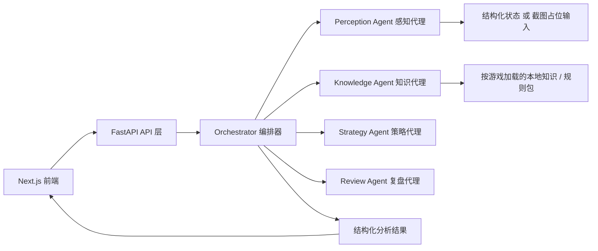

# GameBuddy Agent

GameBuddy Agent 是一个面向游戏教学、策略解释与赛后复盘的开源 AI 游戏助手。  
当前项目支持多个演示游戏场景，首个完成度最高的 MVP 仍然是“类宝可梦回合制对战”。目前支持两种输入方式：

- 上传游戏截图
- 粘贴结构化战局 JSON

系统会返回：

- 当前局势摘要
- 短期战术建议
- 面向新手的解释
- 风险与不确定性说明
- 下一步检查清单
- 赛后复盘 / 教练式总结页

这个项目**不是**外挂、脚本、自动化 Bot、内存读取器，也不会尝试规避反作弊。它是一个用于教学、策略辅助与复盘分析的安全型项目。

## 为什么这个项目有意义

很多“游戏 AI”项目容易走向两个极端：

- 要么过度宣传视觉理解能力，实际难以复现
- 要么逐步滑向自动化、代打、外挂式能力

GameBuddy Agent 的定位刚好相反：

- MVP 范围小而完整
- 对能力边界保持诚实
- 以教学、解释、复盘为核心价值
- 架构模块化，方便开源协作扩展

如果你是招聘者、开源维护者或潜在贡献者，这个仓库可以在 2 分钟内展示清楚：

- 产品定义是否收敛
- 前后端架构是否清晰
- API 设计是否稳定
- 工程结构是否适合协作
- 功能边界是否真实可信

## 功能特性

- 支持上传截图或提交结构化战局 JSON
- 输出战术建议、置信度与不确定性说明
- 提供新手友好的解释层
- 提供复盘报告页面
- 提供可直接游玩的网页游戏模式
- Python 多代理后端架构
- 本地知识库驱动，避免昂贵外部依赖
- 内置示例 Prompt、示例战局与展示用 UI

## MVP 选择

当前支持的 Demo 游戏：

- 类宝可梦回合制对战
- MOBA 赛后复盘 Demo
- RPG Build / 配装建议 Demo

当前支持的网页可玩模式：

- Heroes & Monsters Web
- MOBA Sandbox
- RPG Build Lab

本项目首个 MVP 选择：**类宝可梦回合制对战教练**

选择原因：

- 最容易公开演示，不依赖脆弱的专有 API
- 战局天然适合结构化 JSON 表达
- 很适合做“下一步怎么打”“哪里失误了”“新手怎么理解”这类回答
- 截图输入可以先走可插拔感知层，后续再升级 OCR / CV

## 当前已实现内容

- 完整的 JSON 战局分析流程
- 截图上传接口
- 感知代理、知识代理、策略代理、复盘代理、编排器
- 前端中英双语切换
- 前端首页、输入面板、建议卡片、复盘页
- 多游戏选择器与示例状态切换
- 浏览器可玩游戏大厅 `/play`
- `Heroes & Monsters` 网页改编版
- MOBA 与 RPG 网页沙盒
- 本地知识库与 3 份示例战局
- Docker、测试、开发文档、路线图

## 当前明确为 Mock / 占位的部分

- 截图识别目前是**诚实的占位实现**
- 截图接口可正常工作，但不会假装拥有真实视觉识别能力
- 当前截图分析会走 MVP 的感知占位层，并返回明确的不确定性说明
- 没有接入实时游戏数据、没有外部付费模型依赖、没有自动化游戏能力

## 系统设计



## 仓库结构

```text
frontend/
  app/
  components/
  lib/
backend/
  app/
    api/routes/
    agents/
    core/
    knowledge/
    models/
    services/
  tests/
docs/
samples/
  game-states/
  screenshots/
```

## 快速开始

### 本地开发

1. 启动后端：

```powershell
cd backend
python -m venv .venv
.venv\Scripts\Activate.ps1
pip install -r requirements.txt
uvicorn app.main:app --reload
```

2. 在第二个终端启动前端：

```powershell
cd frontend
npm install
npm run dev
```

3. 打开 `http://localhost:3000`

### Docker

```bash
docker compose up --build
```

## 示例资源

- 展示占位图：`frontend/public/demo/placeholder-battle.svg`
- 示例战局：
  - `samples/game-states/balanced-position.json`
  - `samples/game-states/moba-comeback-window.json`
  - `samples/game-states/rpg-mage-build.json`
  - `samples/game-states/defensive-stall-break.json`
  - `samples/game-states/closing-out-a-lead.json`

## 如何替换截图占位图

仓库内已经包含用于 GitHub 展示的默认占位图。若你想把项目做成更完整的展示页，可以替换为你自己的安全截图资源：

1. 替换 `frontend/public/demo/placeholder-battle.svg`
2. 将额外截图放到 `samples/screenshots/`
3. 如果你添加了正式展示图，记得同步更新本 README

## 示例提问

- 我下一步应该做什么？
- 这里我最大的失误是什么？
- 给我 3 条新手建议
- 如果我想稳一点，最安全的打法是什么？
- 现在最需要尊重的威胁是什么？
- 我这局的胜利条件应该是什么？
- 我怎样才能不把优势送掉？
- 如果我已经落后，应该怎么先稳住？
- 我现在最该保留哪只核心单位？
- 请用新手也能听懂的方式解释这一回合

## Demo 录屏脚本

可以按下面流程录一个 60 到 90 秒的项目演示视频：

1. 打开首页，展示项目标题、定位和示例 Prompt
2. 使用 `balanced-position.json`，输入问题“我下一步应该做什么？”
3. 展示战术建议卡片、置信度标签和不确定性说明
4. 打开复盘页，展示“可能的失误”和“长期改进建议”
5. 返回首页，切换到截图模式，上传占位图并说明：截图理解当前仍是诚实的 MVP 占位实现
6. 最后展示 README 中的系统设计图和未来路线图

## API 概览

- `GET /health`
- `POST /api/v1/analyze/state`
- `POST /api/v1/analyze/screenshot`

完整接口说明见：`docs/api.md`

## 开发文档

- `docs/architecture.md`
- `docs/agents.md`
- `docs/api.md`
- `docs/future-roadmap.md`

## 测试

```powershell
cd backend
pytest
```

## 贡献指南

欢迎贡献。这个项目的原则是：

- 优先保证模块边界清晰
- 优先做诚实可运行的 MVP 改进
- 避免伪集成和“看起来很智能”的假功能
- 功能变化尽量配套测试、示例数据和文档

建议协作流程：

1. 先提 Issue，说明要解决的用户问题
2. 扩展代理时尽量保持 API 结构稳定
3. 行为变化要同步补测试
4. 新增游戏知识源时要补文档说明

## 适合开源贡献者的 Good First Issues

- 为前端 JSON 输入增加更友好的校验提示
- 扩展策略代理，对“换人 / 保核心 / 先稳局”给出更细化建议
- 增加 SQLite 本地历史记录
- 给截图输入做一个真实但轻量的 OCR 原型
- 基于同一编排器协议增加第二个游戏 Demo 包

## 招聘者 2 分钟阅读摘要

这个仓库能快速说明以下几点：

- 这是一个收敛清晰的产品，而不是无边界概念堆砌
- 后端是可扩展的多代理架构，而不是写死在单文件里的 Demo
- 前后端契约是清晰的，返回结构稳定
- UI 已经具备 GitHub Showcase 质量
- 文档、样例数据、演示脚本和未来路线都已经准备好

如果你只看 README，也能快速理解这个项目做什么、怎么跑、架构怎么拆、哪些地方是真实现、哪些地方是诚实占位。

## 免责声明

GameBuddy Agent 不提供以下能力：

- 游戏作弊自动化
- 输入注入
- 进程内存读取
- 反作弊规避
- 代打式 Bot 行为
- 利用漏洞进行自动操作

它只用于：

- 教学指导
- 策略建议
- 局势解释
- 赛后复盘
